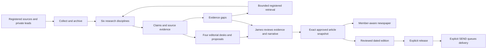

# Thursday Post architecture

One Next.js application serves readers at `/` and private workflows at `/newsroom`, `/editorial/[id]` and `/operations`. Owner and member identities are separate. The existing [Vercel project](https://the-racing-desk.vercel.app) and repository names remain unchanged. Local SQLite and configured Sydney Neon Postgres implement the same storage contracts. Deployment verification of the expanded candidate is pending.

## Evidence and editorial flow

`service.ts` leases collection/research and persists checkpoints. `ingestion.ts` applies registered-host, public DNS, redirect, robots, size and deadline restrictions. Collection-only mode makes no model call. Live research consumes fresh items, reader leads and previously collected unassigned records. It handles at most three stories/two rounds, with up to two additional retrieved items per story.

`providers.ts` supplies six research and four editorial prompts. Models receive bounded excerpts; they do not independently browse or prove underlying assertions. `engine.ts` verifies literal passages, retains disputed/unverified claims and creates a safe attributed draft. Proposed prose/headlines remain separate until James saves an attested edit with verified claim links. Generic gaps require an owner resolution with supporting claims.

Draft hashes cover prose, metadata, access and review attestations/revisions. History retains replaced drafts; approval rechecks the current draft and policy. Internal A/B/N tone is private; B is adverse/dubious and requires a right-of-reply outcome or rationale. Corrections are separate linked stories. Withdrawal changes status/audit metadata without rewriting approved originals. Later evidence creates an owner review alert.

## Access, editions and delivery

`members.ts` manages sign-in, sessions, paid access and delivery preferences. `commerce.ts` handles owner-validated monthly AUD pricing, closed-by-default sales, Stripe checkout/portal and signed webhook reconciliation. Server projections enforce article/edition access. New articles default to members; free samples require an explicit owner action.

`editions.ts` stores dated/numbered, ordered article snapshots and review hashes. Editing, release and SEND are distinct. `delivery.ts` creates jobs only after owner SEND, rechecks recipient eligibility and publication status, and uses leases, bounded retries and provider idempotency. Signed events update delivery/suppression state. Unsubscribing stops edition emails independently of billing.

## Persistence and operations

`store.ts` retains the newsroom aggregate; `durable-store.ts` isolates commerce, editions, delivery and operations documents. Mutations lock transactionally; external calls occur outside transactions. This remains a modest-volume, single-owner design. Partition the aggregate and archives before substantial growth.

`operations.ts` records `demo`, `live` and `collect` runs, provider usage, safe failure categories and explicit-rate estimates. Expired lease recovery marks prior records interrupted. Owner alerts require an explicit action and a configured single recipient.

The daily cron first processes at most two jobs from previously authorized campaigns, even while monitoring is paused. Enabled monitoring selects source-only collection when AI is paused, otherwise live research. A shared 270-second budget leaves headroom under the 300-second hosted limit. Cron does not approve articles, release editions, create campaigns or send owner alerts.

`backup.ts` exports the complete private store/documents through an owner-only download. Strict version/schema/digest checks and consistent revision windows guard export. Restore tooling accepts new local files or explicitly different empty Postgres databases; no HTTP overwrite endpoint exists. See [the runbook](OPERATIONS_RUNBOOK.md).

## Integration status

Source text, reader mail and model output are untrusted. Demo data never becomes a live public publication. AI is paused; Stripe/Resend connections are incomplete, sales closed and price unset. Gmail forwarding remains separate configuration. Licensed racing data, expert outreach, private social access and media forensics are not supplied by these adapters. Fixture tests and CI definitions do not establish live-provider or deployed readiness; see [acceptance](acceptance.md).
