# The Racing Desk — first release

One Next.js application. Six research disciplines and four PE desks retain separate contracts and run records. A shared evidence hub stores provenance; the controller performs bounded targeted follow-ups. An explicit James decision is the only publication path. Demo material is excluded from the public newspaper.

The local store is SQLite; the deployed Vercel app uses free Neon Postgres in Sydney. Both persist the same typed newsroom aggregate transactionally. External calls take place outside database transactions; a durable expiring lease prevents overlapping runs and a revision check prevents stale decisions. This is a lean single-owner architecture, suitable for modest source volumes, not an unlimited news archive.

Vercel hosts [the-racing-desk.vercel.app](https://the-racing-desk.vercel.app) in `jwcoleman87-collabs-projects`. Cron is configured but monitoring is paused. AI Gateway is the model adapter; live AI activation is deferred at James’s request after Gateway returned `403 customer_verification_required`. `NEWSROOM_AI_PAUSED=true` rejects live GO before provider access. Fixture mode exercises the same orchestration without model calls.

The public reader address is `workbenchadmin@gmail.com`; infrastructure account identities and any verified sending domain remain separate. Saved `.eml` import is available. Automatic inbound email is not yet connected: it needs a dedicated Resend receiving address, API key, webhook signing secret, `NEWSROOM_INBOUND_ADDRESS`, and Gmail forwarding. The inbound adapter validates delivery signatures and the configured recipient. Entering a contact address grants no mailbox access.

Source content, customer emails and model output are untrusted data. Verification remains conservative. Paid feeds, private social accounts, photography rights, and licensed form data are explicit adapters, not assumed permissions.

```mermaid
flowchart LR
  S[Sources & reader email] --> D[Discovery & selection]
  D --> R[Six research disciplines]
  R --> H[Verified Research Hub]
  H --> C[Completeness controller]
  C -->|Exact evidence gap| R
  C --> E[Four PE editorial desks]
  E -->|Editorial gap| C
  E --> G[Compliance]
  F[Separate form analysis] --> G
  G --> J[James: approve / reject / send back]
  J -->|Explicit approval only| P[Public newspaper]
  classDef source fill:#fff0ad,color:#302c12
  classDef discovery fill:#cce8cc,color:#173e20
  classDef research fill:#cee4ff,color:#163554
  classDef hub fill:#e7d7fa,color:#40265a
  classDef controller fill:#ffe0b0,color:#543312
  classDef gate fill:#fad6df,color:#612234
  class S source
  class D,E discovery
  class R research
  class H hub
  class C controller
  class G,J gate
```

